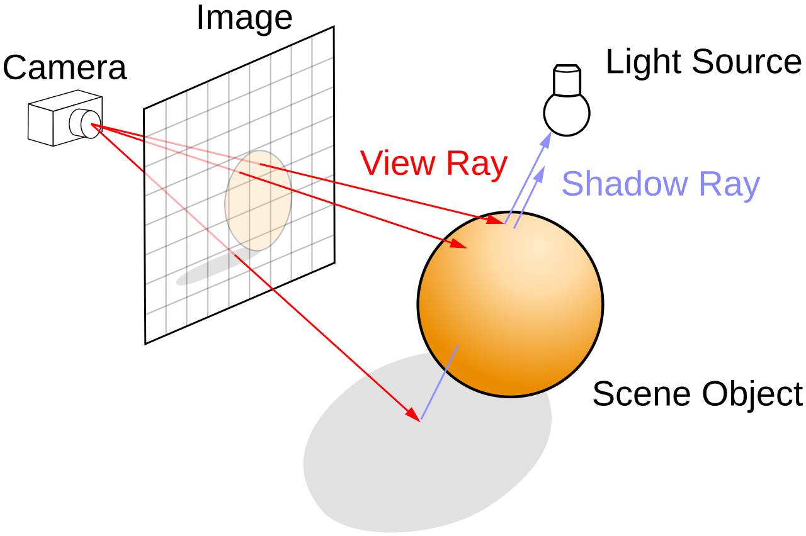
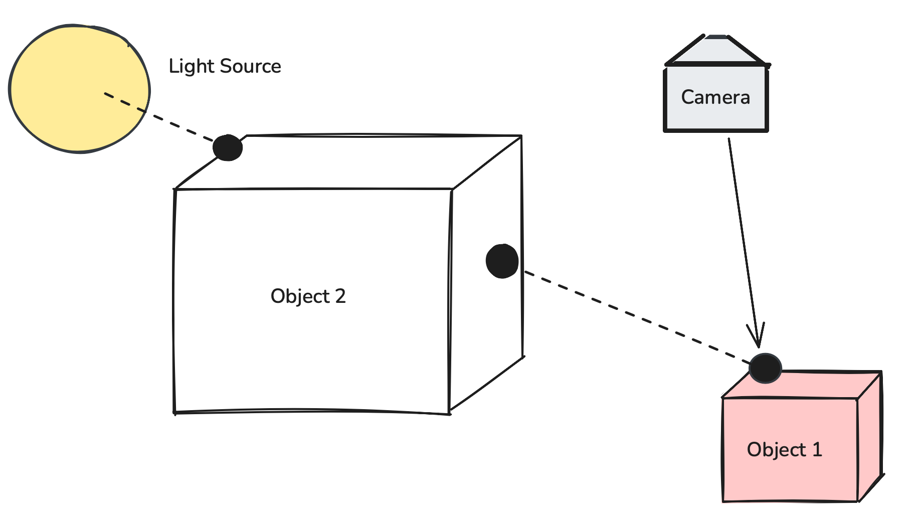
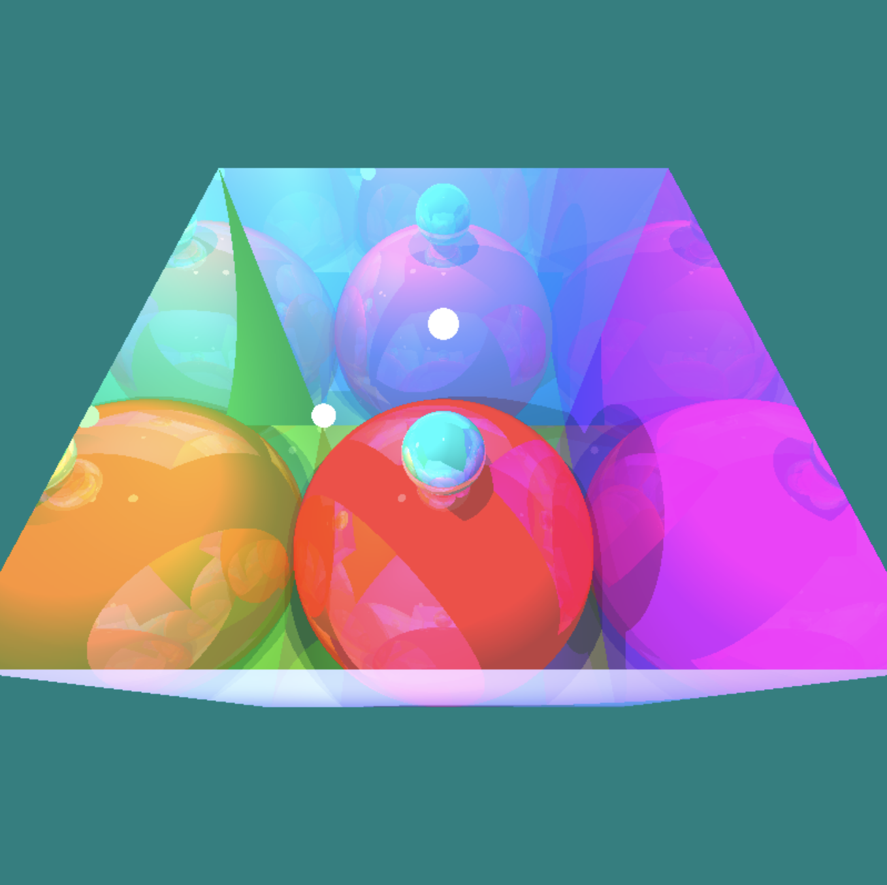
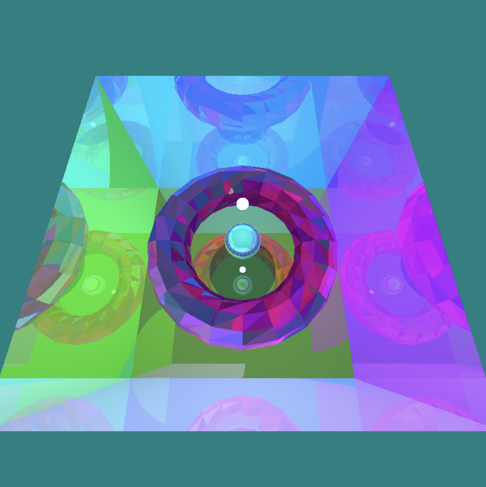
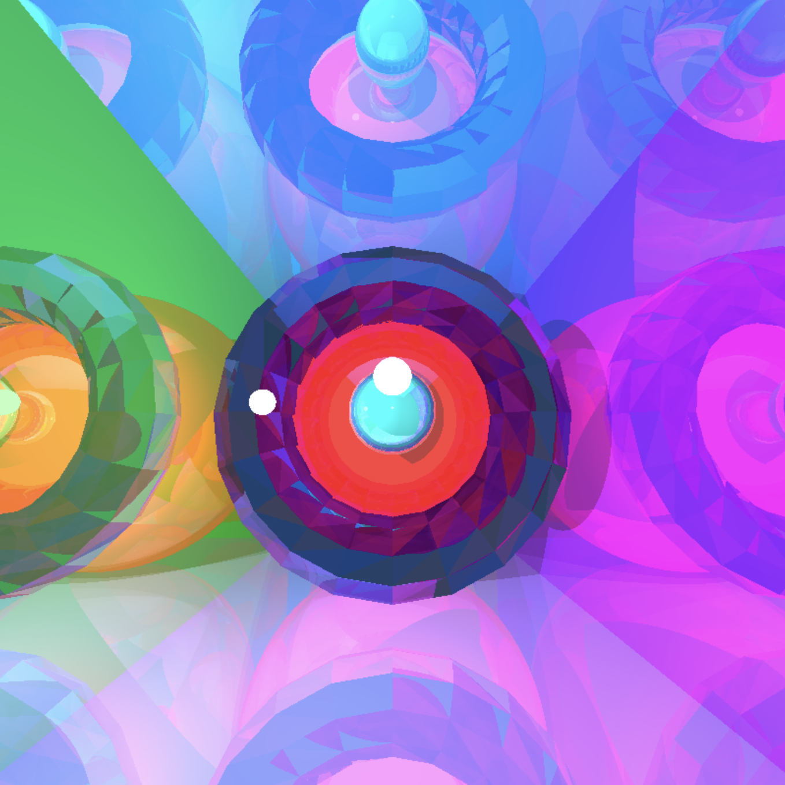

# Raytracer JS
A fully custom CPU raytracer written from scratch in JavaScript. This project:
*  Implements analytic sphere intersection and Möller–Trumbore ray–triangle intersection
* Supports reflective materials through recursive secondary rays
* Computes direct lighting with shadow rays
* Has "portal" flags to create one way mirrors

No external tools such as WebGL or Three.js were used in this project.

## What is Raytracing? 🔦
In the real world, light rays scatters from a source in all different directions. Only the rays that manage to reach your eyes are the ones you percieve. In raytracing, the opposite happens: you shoot rays from your eyes (like Superman!) into the scene, and the rays that manage to hit a light source are the ones that are rendered.

## Camera 📷
* Resolution = $800 \times 800$
* Right hand basis for orientation: `camera.forward, camera.right, camera.up`
## Ray Generation
   
1. For every `(x,y)` in screen coordinates (resolution `800x800`), translate to normalized view coordinates `(u,v)`, where `u = ((x + 0.5) / WIDTH) * 2 - 1` and `v = ((y + 0.5) / HEIGHT) * 2 - 1`
2. Define the plane half height using the formula `tan(fov / 2)` (detailed explanation can be found in my  <a href=https://github.com/mojofill/rasterizer-js>software rasterizer</a> program)
3. Plane half width is is simply `planeHalfHeight * WIDTH / HEIGHT`
4. Locate center of view plane, which is center of camera + forward vector: `vec3add(camera.position, camera.forward)`
5. Finally, match the pixel to a point in world space via `pixelPoint = viewPlaneCenter + u • camera.right + v • camera.up`
6. Define ray with `origin = camera.position, direction = pixelPoint - origin`.

Now we have rays pointing outwards from the camera to the screen into world space!

## Geometries
All objects can be broken down into triangles. In this project, spheres, tori, and cubes. Many more object can be raytraced, but that is beyond the scope of this project.

However, sphere's have a nice property: the normal of a sphere is simply `intersectionPoint - sphereCenter`. This makes calculating reflections and intersection much easier and less computationally expensive than triangulating the sphere.

# NOTE - MAKE A COMPARISON BETWEEN TRIANGULATED SPHERE VS ANALYTICAL SPHERE: use images

## Materials
```js
let sampleMaterial = { color: vec3, reflectivity: number, emissive: vec3, isPortal: boolean }
```

* `reflectivity` is a number between `[0, 1]` that describes how reflective a material is
* `emissive` is used when a light source is directly visible by the camera, such as a visible light bulb
* `isPortal` allows for one way mirrors, allowing initial rays from the camera pass through a surface, then treating the surface as a reflective mirror.

## Lighting & Shadows
Point light sources are scattered around the scene. For every point a ray intersects, the contributions of all the light sources on the scene that contribute its light are summed up in the final color.

For each object, a `shadowRay` is calculated for each light source in the scene:
```js
let shadowRay = {origin: intersectionPoint, dir: light.position - intersectionPoint}
```
If the `shadowRay` hits another object in the scene, that means this object is in the shadow of that particular light source.

*In this scenario, even though the camera ray hits the object, at that particular hit point the sole light source in the scene cannot light it up. Ambient lighting helps light it up.*

## Shading
1. Begin with the ambient color `final = ambient * material.color`.
2. For each visible light, add **Lambertian diffuse** (light intensity scaled to surface normal) `final += max(0, dot(normal, light_dir)) * light.color * material.color`.
3. If reflective: compute `reflectRay = ray - 2 * surface_normal` and recursively calculate reflected color by `traceRay(reflectRay, depth--)`.
4. Compute final color via `(1 - reflectivity) * finalColor + reflectivity * reflectedColor`.

Small episilons `1e-6` are used on origins to avoid self hits.

## Light Geometry
Lights contribute to shading and also count as geometric hits. This is done by adding lights as geometry in `findClosestIntersection` and the early `emissive` return in `traceRay` if is a primary ray. This allows lights to rendered as bulbs/flashlights in the scene.

## Screenshots and Results

*Spheres in a reflective open box*


*Reflective torus and sphere in a cornell box*


*Torus and sphere in a different angle*

## Notes
This project currently only supports user defined polygon meshes. In the future I would like to be able to render `.obj` or `.blender` objects in the scene. I also would like to speed up the render time by implementing `WebGPU` or `WegGL` and use the GPU to accelerate computation.
